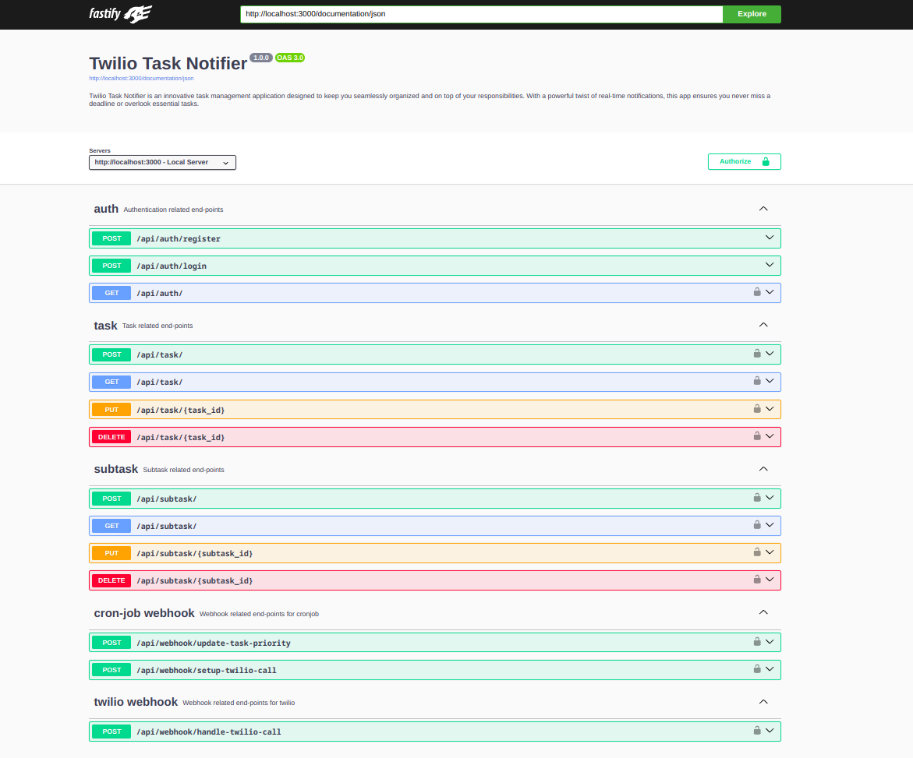
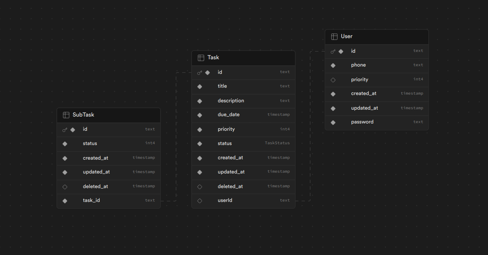

# Twilio Task Notifier - Backend API

> This repository contains my solution for an assignment related to the Backend Engineer Intern position at [Listed](https://listed.fans).



Twilio-Task-Notifier is a feature-rich task management application designed to enhance your organizational efficiency with real-time notifications via phone calls. This backend API is built using Fastify, Typescript, Prisma, and connects to a Postgres database. It leverages Cron Jobs to ensure timely updates and notifications.

## Features

- Seamless integration with Swagger UI for API exploration.
- Utilizes Fastify for a high-performance, low-overhead framework.
- Implements Typescript for strong typing and enhanced developer experience.
- Leverages Prisma as an efficient and type-safe database access tool.
- Stores data in a Postgres database for reliability and scalability.
- Employs Cron Jobs for scheduled tasks using https://cron-job.org

## Database Schema Diagram



## Installation

```bash
$ git clone https://github.com/vishalx360/twilio-task-notifier.git
$ cd twilio-task-notifier
$ npm install
```

## Usage

### Development

```bash
# Watch and compile Typescript
$ npm run watch

# Start development server with hot reload (nodemon)
$ npm run dev

# Format code with prettier
$ npm run format
```

### Production

```bash
# Build for production
$ npm run build

# Start production app
$ npm run start
```

Feel free to customize the content further to better fit your project specifics and provide additional details if needed.
